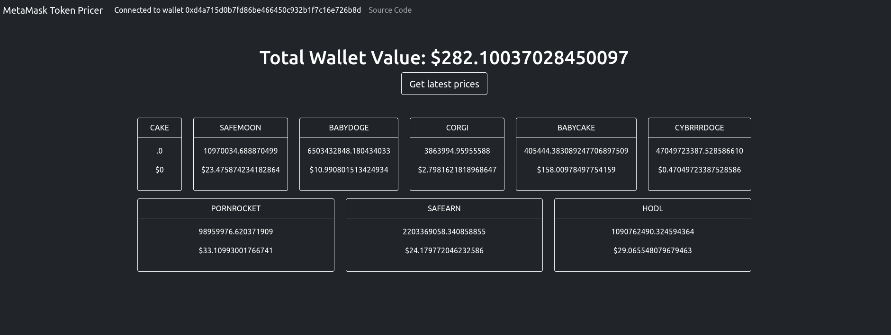

# MetMask Token Pricer

A simple web app that connects to your wallet, and fetches the value of the tokens that you have stored.

The app uses the [web3.js](https://github.com/ChainSafe/web3.js) library  and the [CoinGecko API Client](https://github.com/miscavage/CoinGecko-API)
to fetch tokens from the MetaMask wallet and token prices from CoinGecko.

To run the app locally: `yarn start`

It should look something like this:

(The above is not in anyway an endorsement, do your own research before investing)

This will eventually be hosted somewhere.

## Contributing

Raise an issue to discuss the improvement or bug fix, then a pull request can be raised. More information can be found here

## License

[MIT](LICENSE)
